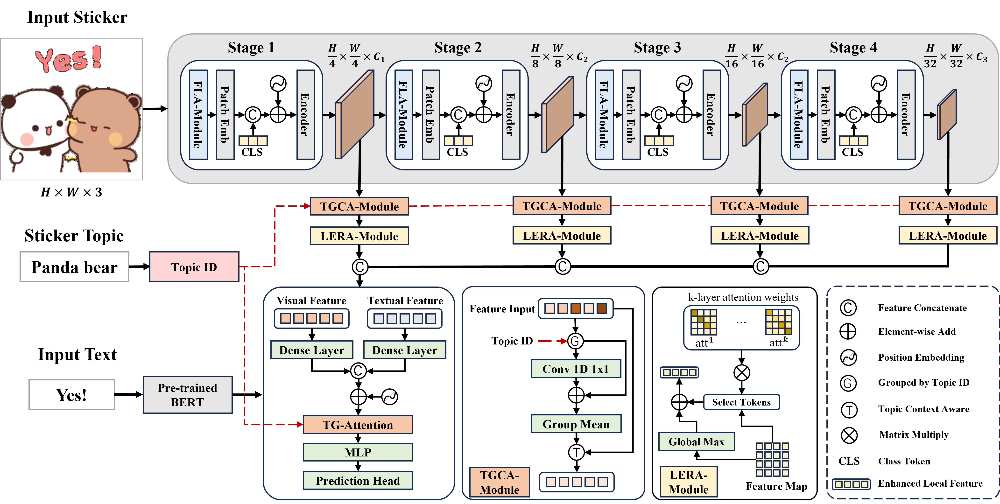

# <p align="center">TGCA-PVT: Topic-Guided Context-Aware Pyramid Vision Transformer for Sticker Emotion Recognition </p>

This is the official repository of our ACM Multimedia 2024 Work in Pytorch. Our conference paper is now released at https://dl.acm.org/doi/abs/10.1145/3664647.3680781. We also provide a supplementary pdf of additional experimental results in supplement.pdf here.

## Abstract
Online chatting has become an essential aspect of our daily interactions, with stickers emerging as a prevalent tool for conveying emotions more vividly than plain text. While conventional image emotion recognition focuses on global features, sticker emotion recognition necessitates incorporating both global and local features, along with additional modalities like text. To address this, we introduce a topic ID-guided transformer method to facilitate a more nuanced analysis of the stickers. Considering that each sticker will have a topic, and stickers with the same topic will have the same object, we introduce a topic ID and regard the stickers with the same topic ID as topic context. Our approach encompasses a novel topic-guided context-aware module and a topic-guided attention mechanism, enabling the extraction of comprehensive topic context features from stickers sharing the same topic ID, significantly enhancing emotion recognition accuracy. Moreover, we integrate a frequency linear attention module to leverage frequency domain information to better capture the object information of the stickers and a locally enhanced re-attention mechanism for improved local feature extraction. Extensive experiments and ablation studies on the large-scale sticker emotion dataset SER30k validate the efficacy of our method. Experimental results show that our proposed method obtains the best accuracy on both single-modal and multi-modal sticker emotion recognition.

## Innovations:
**Frequency linear attention module (FLA-Module)** with frequency MLP and frequency attention for object information enhancement.

**Local enhanced re-attention module (LERA-Module)** for better capture the relationship between the local and global features.

**Topic-guided context-aware module (TGCA -module)** for context feature extraction for the same topic.

**Topic-guided attention (TG-Attention)** for better capture features from stickers with the same topic ID.




## SER30K dataset

The SER30K dataset  should be applied  and downloaded at https://github.com/nku-shengzheliu/SER30K.

## Prerequisites

- Python 3.6
- Pytorch 1.10.2
- Others (Pytorch-Bert, etc.) Check requirements.txt for reference.

In addition, please download the ImageNet pre-trained model weights for PVT-small from [PVT](https://github.com/whai362/PVT/tree/v2/classification) and place it in the `./weight` folder.


## Training
To train TGCA-PVT on SER30K on a single node with 2 gpus for 50 epochs run:


```shell
python -m torch.distributed.launch --nproc_per_node=2 --master_port=6666 \
--use_env main.py \
--config configs/pvt/pvt_small.py \
--visfinetune weights/pvt_small.pth \
--output_dir checkpoints/SER \
--dataset SER \
--data-path {path to SER30K dataset} \
--alpha 8 \
--batch-size 16 \
--locals 1 1 1 0
```


## Evaluation
To evaluate TGCA-PVT model performance on SER30K with a single GPU, run the following script using command line:

```shell
python -m torch.distributed.launch --nproc_per_node=1 --master_port=6666 \
--use_env main.py \
--config configs/pvt/pvt_small.py \
--resume checkpoints/SER/checkpoint_best.pth \
--dataset SER \
--data-path {path to SER30K dataset} \
--batch-size 16 \
--alpha 8 \
--locals 1 1 1 0 \
--eval
```

## Citation

If you find this code to be useful for your research, please consider citing.
```shell
@inproceedings{chen2024tgca,
  title={TGCA-PVT: Topic-Guided Context-Aware Pyramid Vision Transformer for Sticker Emotion Recognition},
  author={Chen, Jian and Wang, Wei and Hu, Yuzhu and Chen, Junxin and Liu, Han and Hu, Xiping},
  booktitle={Proceedings of the 32nd ACM International Conference on Multimedia},
  pages={9709--9718},
  year={2024}
}
```
